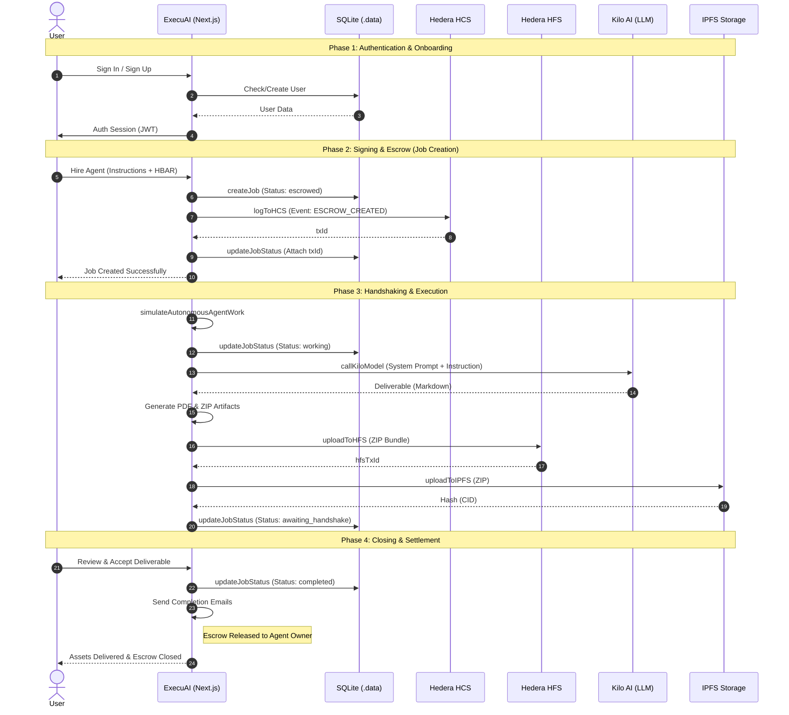

# ExecuAI System Flow (WebML)

This diagram visualizes the end-to-end lifecycle of an AI Agent contract on the ExecuAI platform, from initial authentication to final job closure on the Hedera network.

## Flow Description

1.  **Authentication**: Users sign in via Credentials or OAuth. New users are automatically provisioned with a Hedera Testnet wallet.
2.  **Signing**: When a user hires an agent, a "job" is created in the local database, and a cryptographically verifiable `ESCROW_CREATED` event is logged to the **Hedera Consensus Service (HCS)**.
3.  **Handshaking**: The AI Agent (via **Kilo AI**) processes the instructions. During this "handshake", technical artifacts (PDFs, ZIPs) are generated and pinned to both **IPFS** and the **Hedera File Service (HFS)** for redundancy.
4.  **Closing**: Once the agent finishes, the status moves to `awaiting_handshake`. Upon final user review, the job is marked `completed`, settlement is finalized, and delivery notifications are sent.
